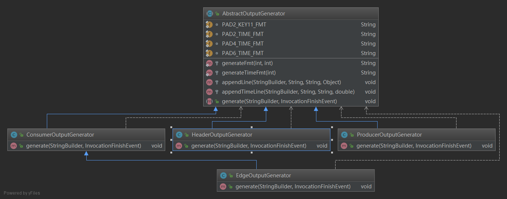

# APM-AGENT 时间统计汇总

## 调用输出的日志

**consumer 端**
```
// HeaderOutputGenerator.java
CONSUMER highway springmvc.springmvcHello.sayHi:
  http method: POST
  url        : /springmvchello/sayhi/
  status code: 200
  traceId    : 5baef478916b46dd
  total                    : 5.136ms
    prepare                : 0.525ms
//-------------------------------------------------
//ConsumerOutputGenerator.java
    handlers request       : 0.955ms
    client filters request : 0.001ms
    send request           : 0.363ms
      get connection       : 0.029ms
      write to buf         : 0.334ms
    wait response          : 2.793ms
    wake consumer          : 0.017ms
    client filters response: 0.140ms
    handlers response      : 0.340ms

//==============================================================================
// HeaderOutputGenerator.java
CONSUMER rest springmvc.springmvcHello.sayHello:
  http method: POST
  url        : /springmvchello/sayhello/
  status code: 200
  traceId    : 5baef4788ebfae46
  total                    : 5.004ms
    prepare                : 0.069ms
//----------------------------------------
//ConsumerOutputGenerator.java
    handlers request       : 0.469ms
    client filters request : 0.114ms
    send request           : 1.162ms
      get connection       : 0.676ms
      write to buf         : 0.486ms
    wait response          : 2.927ms
    wake consumer          : 0.004ms
    client filters response: 0.183ms
    handlers response      : 0.074ms
```
**producer 端**

```
// HeaderOutputGenerator.java
PRODUCER highway springmvc.springmvcHello.sayHi:
  http method: POST
  url        : /springmvchello/sayhi/
  status code: 200
  traceId    : 5baef477de52efb6
  total                    : 39.999ms
    prepare                : 35.572ms
//---------------------------------------------
// ProducerOutputGenerator.java
    threadPoolQueue        : 0.871ms
    server filters request : 0.186ms
    handlers request       : 0.854ms
    springmvcHello.sayHi   : 0.070ms
    handlers response      : 0.050ms
    server filters response: 1.723ms
    send response          : 0.670ms

//==============================================================================

PRODUCER rest springmvc.springmvcHello.sayHello:
  http method: POST
  url        : /springmvchello/sayhello/
  status code: 200
  traceId    : 5baef478728add5f
  total                    : 8.664ms
    prepare                : 0.136ms
//-----------------------------------------------
//ProducerOutputGenerator.java
    threadPoolQueue        : 0.356ms
    server filters request : 0.939ms
    handlers request       : 6.509ms
    springmvcHello.sayHello: 0.096ms
    handlers response      : 0.037ms
    server filters response: 0.217ms
    send response          : 0.189ms

```
## InvocationStageTrace.java
放置着主要的**日志参数**,和**日志信息**. 不管是 apm 日志信息还是 现在metrics 的日志信息,都是从这里面取得,只是取值的方式有所不同.例如 apm 取值比较全,是每次调用取一次值,而 metrics 是每几秒周期性汇总一次,主要显示的信息是平均值和最大值

```java

  public static final String PREPARE = "prepare";

  public static final String HANDLERS_REQUEST = "handlers request";

  public static final String HANDLERS_RESPONSE = "handlers response";

  public static final String CLIENT_FILTERS_REQUEST = "client filters request";

  public static final String CONSUMER_SEND_REQUEST = "send request";

  public static final String CONSUMER_GET_CONNECTION = "get connection";

  public static final String CONSUMER_WRITE_TO_BUF = "write to buf";

  public static final String CONSUMER_WAIT_RESPONSE = "wait response";

  public static final String CONSUMER_WAKE_CONSUMER = "wake consumer";

  public static final String CLIENT_FILTERS_RESPONSE = "client filters response";

  public static final String THREAD_POOL_QUEUE = "threadPoolQueue";

  public static final String SERVER_FILTERS_REQUEST = "server filters request";

  public static final String SERVER_FILTERS_RESPONSE = "server filters response";

  public static final String PRODUCER_SEND_RESPONSE = "send response";

  private Invocation invocation;

  private long start;

  private long startHandlersRequest;

  private long startClientFiltersRequest;

  // only for consumer
  private long startSend;

  // only for consumer
  private long finishGetConnection;

  // only for consumer
  private long finishWriteToBuffer;
  // only for consumer
  private long finishReceiveResponse;

  private long startClientFiltersResponse;

  private long finishClientFiltersResponse;

  private long finishHandlersResponse;

  private long finish;

  // only for producer: put producer task to thread pool
  private long startSchedule;

  private long startServerFiltersRequest;

  private long finishServerFiltersResponse;

  // only for producer: start execute in work thread
  //           for reactive mode, work thread is eventloop
  private long startExecution;

  // only for producer
  private long startBusinessMethod;

  // only for producer
  private long finishBusiness;
```
>  **下面所有的日志信息基本都是从这里进行计算取得的**

## 日志输出
下面是打印运行信息的整体逻辑

```java

    StringBuilder sb = new StringBuilder();
   //输出 header 日志信息
    headerOutputGenerator.generate(sb, event);
    if (event.getInvocation().isConsumer()) {
      if (event.getInvocation().isEdge()) {
        //边缘调用的话, 输出边缘调用日志信息
        edgeOutputGenerator.generate(sb, event);
      } else {
		// 消费者日志信息
        consumerOutputGenerator.generate(sb, event);
      }
    } else {
	//生产者日志信息
      producerOutputGenerator.generate(sb, event);
    }
    System.out.println(sb.toString());

```
> 消费者可以是普通的调用 方式, 也可以是采用 edge 的边缘调用方式.输出是根据生产者 和消费者分别输出的, 也就是 生产者不会输出 消费者的日志信息.



> apm 日志信息输出的 uml 类图

## HeaderOutputGenerator.java 日志输出

```java
    appendLine(sb, PAD2_KEY11_FMT, "http method", restOperationMeta.getHttpMethod());
    appendLine(sb, PAD2_KEY11_FMT, "url", restOperationMeta.getAbsolutePath());
    appendLine(sb, PAD2_KEY11_FMT, "status code", event.getResponse().getStatusCode());
    appendLine(sb, PAD2_KEY11_FMT, "traceId", invocation.getTraceId());

    appendTimeLine(sb, PAD2_TIME_FMT, "total", stageTrace.calcTotalTime());	
	// key 是 "prepare"
    appendTimeLine(sb, PAD4_TIME_FMT, InvocationStageTrace.PREPARE, stageTrace.calcInvocationPrepareTime());

```
> * **http method** , **url** , **status code** , **traceId**  都是直接从类里面的属性值 直接读取的
> * **total** : **finsh - start** , finsh 和 start 都是 InvocationStageTrace的属性
> * **InvocationStageTrace.PREPARE** : 如果调用方是消费者而且不是通过边缘调用, 是 **startHandlersRequest - start**, 否则就是 **startSchedule - start**
> 
> ```java
> 
>   public double calcInvocationPrepareTime() {
>    if (invocation.isConsumer() && !invocation.isEdge()) {
>      return calc(startHandlersRequest, start); 
>    }   
>    return calc(startSchedule, start);
>  }       
>  
> ```

## ConsumerOutputGenerator.java日志输出
 
```java
    InvocationStageTrace stageTrace = event.getInvocation().getInvocationStageTrace();
	// key : "handlers request"
    appendTimeLine(sb, PAD4_TIME_FMT, InvocationStageTrace.HANDLERS_REQUEST, stageTrace.calcHandlersRequestTime());
	// key :　"client filters request"
    appendTimeLine(sb, PAD4_TIME_FMT, InvocationStageTrace.CLIENT_FILTERS_REQUEST,
        stageTrace.calcClientFiltersRequestTime());
	// key : "send request"
    appendTimeLine(sb, PAD4_TIME_FMT, InvocationStageTrace.CONSUMER_SEND_REQUEST, stageTrace.calcSendRequestTime());
	// key :　"get connection"
    appendTimeLine(sb, PAD6_TIME_FMT, InvocationStageTrace.CONSUMER_GET_CONNECTION, stageTrace.calcGetConnectionTime());
	// key : "write to buf"
    appendTimeLine(sb, PAD6_TIME_FMT, InvocationStageTrace.CONSUMER_WRITE_TO_BUF, stageTrace.calcWriteToBufferTime());
	// key :　"wait response"
    appendTimeLine(sb, PAD4_TIME_FMT, InvocationStageTrace.CONSUMER_WAIT_RESPONSE,
        stageTrace.calcReceiveResponseTime());
	// key : "wake consumer"
    appendTimeLine(sb, PAD4_TIME_FMT, InvocationStageTrace.CONSUMER_WAKE_CONSUMER, stageTrace.calcWakeConsumer());
	// key : "client filters response"
    appendTimeLine(sb, PAD4_TIME_FMT, InvocationStageTrace.CLIENT_FILTERS_RESPONSE,
        stageTrace.calcClientFiltersResponseTime());
	// key : "handlers response"
    appendTimeLine(sb, PAD4_TIME_FMT, InvocationStageTrace.HANDLERS_RESPONSE, stageTrace.calcHandlersResponseTime());

```


* calc(a , b) 的意思是 a - b, 第一个参数是被减数, 第二个参数是减数
* **InvocationStageTrace.HANDLERS_REQUEST** 

```java
  public double calcHandlersRequestTime() {
    if (invocation.isConsumer()) { 
		// 是消费者
      return calc(startClientFiltersRequest, startHandlersRequest);
    }
	// 是生产者
    return calc(startBusinessMethod, startHandlersRequest);
  }

```
* **InvocationStageTrace.CLIENT_FILTERS_REQUEST**

```java
  public double calcClientFiltersRequestTime() {
    return calc(startSend, startClientFiltersRequest);
  }
```

* **InvocationStageTrace.CONSUMER_SEND_REQUEST**

```java
  public double calcSendRequestTime() {
    return calc(finishWriteToBuffer, startSend);
  }
```

* **InvocationStageTrace.CONSUMER_GET_CONNECTION**

```java
  public double calcGetConnectionTime() {
    return calc(finishGetConnection, startSend);
  }
```

* **InvocationStageTrace.CONSUMER_WRITE_TO_BUF**

```java

  public double calcWriteToBufferTime() {
    return calc(finishWriteToBuffer, finishGetConnection);
  }

```

* **InvocationStageTrace.CONSUMER_WAIT_RESPONSE**

```java

  public double calcReceiveResponseTime() {
    return calc(finishReceiveResponse, finishWriteToBuffer);
  }

```

* **InvocationStageTrace.CONSUMER_WAKE_CONSUMER**

```java
  public double calcWakeConsumer() {
    return calc(startClientFiltersResponse, finishReceiveResponse);
  }
```

* **InvocationStageTrace.CLIENT_FILTERS_RESPONSE**

```java
  public double calcClientFiltersResponseTime() {
    return calc(finishClientFiltersResponse, startClientFiltersResponse);
  }
```

* **InvocationStageTrace.HANDLERS_RESPONSE**

```java
  public double calcHandlersResponseTime() {
    if (invocation.isConsumer()) {
	// 消费者
      return calc(finishHandlersResponse, finishClientFiltersResponse);
    }	
	// 生产者
    return calc(finishHandlersResponse, finishBusiness);
  }
```

## EdgeOutputGenerator.java 边缘调用日志输出
边缘调用的日志信息输出包含了consumer的日志输出

```java
	// key : "threadPoolQueue"
   appendTimeLine(sb, PAD4_TIME_FMT, InvocationStageTrace.THREAD_POOL_QUEUE, stageTrace.calcThreadPoolQueueTime());
	// key : "server filters request"
    appendTimeLine(sb, PAD4_TIME_FMT, InvocationStageTrace.SERVER_FILTERS_REQUEST,
        stageTrace.calcServerFiltersRequestTime());
	// 调用父类consumer的日志输出
    super.generate(sb, event);
	//key : "server filters response"
    appendTimeLine(sb, PAD4_TIME_FMT, InvocationStageTrace.SERVER_FILTERS_RESPONSE,
        stageTrace.calcServerFiltersResponseTime());
	//key :　"send response"
    appendTimeLine(sb, PAD4_TIME_FMT, InvocationStageTrace.PRODUCER_SEND_RESPONSE, stageTrace.calcSendResponseTime());
```

* **InvocationStageTrace.THREAD_POOL_QUEUE**　

```java
  public double calcThreadPoolQueueTime() {
    return calc(startExecution, startSchedule);
  }
```

* **InvocationStageTrace.SERVER_FILTERS_REQUEST**

```java
  public double calcServerFiltersRequestTime() {
    return calc(startHandlersRequest, startServerFiltersRequest);
  }
```

* **InvocationStageTrace.SERVER_FILTERS_RESPONSE**

```java
  public double calcServerFiltersResponseTime() {
    return calc(finishServerFiltersResponse, finishHandlersResponse);
  }
```

* **InvocationStageTrace.PRODUCER_SEND_RESPONSE**

```java
  public double calcSendResponseTime() {
    return calc(finish, finishServerFiltersResponse);
  }
```

## ProducerOutputGenerator.java 日志输出

这个是生产者一方的日志输出

```java
  public void generate(StringBuilder sb, InvocationFinishEvent event) {
    Invocation invocation = event.getInvocation();
    InvocationStageTrace stageTrace = invocation.getInvocationStageTrace();

	//key : "threadPoolQueue"
    appendTimeLine(sb, PAD4_TIME_FMT, InvocationStageTrace.THREAD_POOL_QUEUE, stageTrace.calcThreadPoolQueueTime());

	// key : "server filters request"
    appendTimeLine(sb, PAD4_TIME_FMT, InvocationStageTrace.SERVER_FILTERS_REQUEST,
        stageTrace.calcServerFiltersRequestTime());

	// key : "handlers request"
    appendTimeLine(sb, PAD4_TIME_FMT, InvocationStageTrace.HANDLERS_REQUEST, stageTrace.calcHandlersRequestTime());

	// 这个没有存储在 invocationStageTrace.java 是从 operationMeta() 中拿出来的
    appendTimeLine(sb, PAD4_TIME_FMT, invocation.getOperationMeta().getSchemaQualifiedName(),
        stageTrace.calcBusinessTime());

	//key : "handlers response"
     appendTimeLine(sb, PAD4_TIME_FMT, InvocationStageTrace.HANDLERS_RESPONSE, stageTrace.calcHandlersResponseTime());

	//key : "server filters response"
    appendTimeLine(sb, PAD4_TIME_FMT, InvocationStageTrace.SERVER_FILTERS_RESPONSE,
        stageTrace.calcServerFiltersResponseTime());
	
	// key : "send response" 
    appendTimeLine(sb, PAD4_TIME_FMT, InvocationStageTrace.PRODUCER_SEND_RESPONSE, stageTrace.calcSendResponseTime());
```

* **InvocationStageTrace.THREAD_POOL_QUEUE**

```java
  public double calcThreadPoolQueueTime() {
    return calc(startExecution, startSchedule);
  }
```

* **InvocationStageTrace.SERVER_FILTERS_REQUEST**

```java
  public double calcServerFiltersRequestTime() {
    return calc(startHandlersRequest, startServerFiltersRequest);
  }
```

* **InvocationStageTrace.HANDLERS_REQUEST**

```java
  public double calcHandlersRequestTime() {
    if (invocation.isConsumer()) {
      return calc(startClientFiltersRequest, startHandlersRequest);
    }

    return calc(startBusinessMethod, startHandlersRequest);
  }

```

* **invocation.getOperationMeta().getSchemaQualifiedName()**

```java
  public double calcBusinessTime() {
    return calc(finishBusiness, startBusinessMethod);
  }
```

* **InvocationStageTrace.HANDLERS_RESPONSE**

```
  public double calcHandlersResponseTime() {
    if (invocation.isConsumer()) {
      return calc(finishHandlersResponse, finishClientFiltersResponse);
    }

    return calc(finishHandlersResponse, finishBusiness);
  }
```

* **InvocationStageTrace.SERVER_FILTERS_RESPONSE**

```java
  public double calcServerFiltersResponseTime() {
    return calc(finishServerFiltersResponse, finishHandlersResponse);
  }
```

* **InvocationStageTrace.PRODUCER_SEND_RESPONSE**

```java
  public double calcSendResponseTime() {
    return calc(finish, finishServerFiltersResponse);
  }
```

----------

