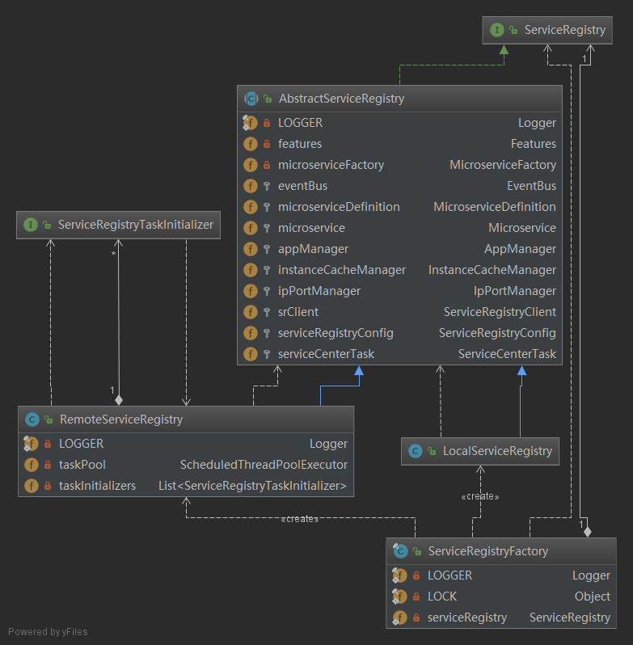
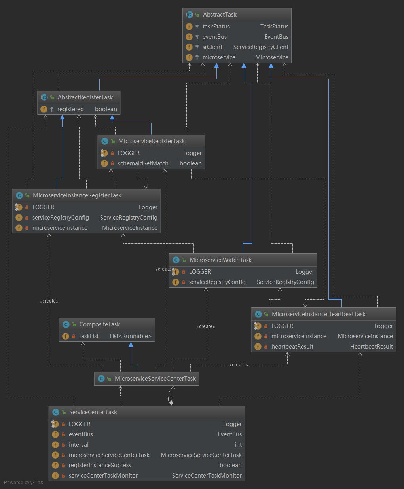

# java chassis 服务中心交互逻辑源码详解

主要是讲述 java chassis 如何与集群 service center 进行注册和交互. 果然整理一下,思路清晰好多

## 注册逻辑 初始化 RegistryUtils.init()


```java

public final class RegistryUtils {
    private static ServiceRegistry serviceRegistry;

   public static void init() {
      
      MicroserviceConfigLoader loader = ConfigUtil.getMicroserviceConfigLoader();
      MicroserviceDefinition microserviceDefinition = new MicroserviceDefinition(loader.getConfigModels());
      // 装载 从配置文件或者环境变量存储的 配置
      serviceRegistry =
          ServiceRegistryFactory
              .getOrCreate(EventManager.eventBus, ServiceRegistryConfig.INSTANCE, microserviceDefinition);
      //创造一个服务注册的主体,并进行初始化
      serviceRegistry.init();
    }
}
  
```
发现是通过 **ServiceRegistryFactory** 来创造 **serviceRegistry** , 我们进入这个类里面

```java
public final class ServiceRegistry{
  // 这里逻辑很简单,做下判断,如果没有 serviceRegistry,就在同步的情况下创一个新的 serviceRegistry 
    public static ServiceRegistry getOrCreate(EventBus eventBus, ServiceRegistryConfig serviceRegistryConfig,
        MicroserviceDefinition microserviceDefinition) {
      if (serviceRegistry == null) {
        synchronized (LOCK) {
          if (serviceRegistry == null) {
            serviceRegistry = create(eventBus, serviceRegistryConfig, microserviceDefinition);
          }
        }
      }
      return serviceRegistry;
    }
    // 根据配置项 来选择创建 RemoteServiceRegistry 还是 LocalServiceRegistry
      public static ServiceRegistry create(EventBus eventBus, ServiceRegistryConfig serviceRegistryConfig,
          MicroserviceDefinition microserviceDefinition) {
        String localModeFile = System.getProperty(LocalServiceRegistryClientImpl.LOCAL_REGISTRY_FILE_KEY);
        if (!StringUtils.isEmpty(localModeFile)) {
          LOGGER.info(
              "It is running in the local development mode, the local file {} is using as the local registry",
              localModeFile);
    
          return new LocalServiceRegistry(eventBus, serviceRegistryConfig, microserviceDefinition);
        }
    
        LOGGER.info("It is running in the normal mode, a separated service registry is required");
        return new RemoteServiceRegistry(eventBus, serviceRegistryConfig, microserviceDefinition);
      }
    
} 

```



RemoteServiceRegistry  进行 init()初始化,发现其调用 父类 AbstractServiceRegistry 的 init(),初始化了一个线程池
**RemoteServiceRegistry.java**

```java

public class RemoteServiceRegistry extends AbstractServiceRegistry{
  @Override
  public void init() {
    super.init();
    taskPool = new ScheduledThreadPoolExecutor(2,
        task -> new Thread(task, "Service Center Task"),
        (task, executor) -> LOGGER.warn("Too many pending tasks, reject " + task.getClass().getName())
    );
  }


  @Subscribe
  public void onShutdown(ShutdownEvent event) {
    LOGGER.info("service center task is shutdown.");
    taskPool.shutdownNow();
  }

  @Subscribe
  public void onPullMicroserviceVersionsInstancesEvent(PullMicroserviceVersionsInstancesEvent event) {
    taskPool.schedule(event.getMicroserviceVersions()::pullInstances, event.getMsDelay(), TimeUnit.MILLISECONDS);
  }

  @Subscribe
  public void onMicroserviceRegistryTask(MicroserviceRegisterTask event) {
    if (event.isRegistered()) {
      ipPortManager.initAutoDiscovery();
    }
  }
}  

```
**AbstractServiceRegistry.java**


```java

public abstract class AbstractServiceRegistry implements ServiceRegistry {
    @Override
    public void init() {
      try {
        //初始化  appManager
        initAppManager();
      } catch (InstantiationException | IllegalAccessException | ClassNotFoundException e) {
        throw new IllegalStateException("Failed to init appManager.", e);
      }
      // 初始化 cacheManager
      initCacheManager();
      // 获取 IpPortManager , 用于存储和管理要注册的 service center 的地址
      ipPortManager = new IpPortManager(serviceRegistryConfig, instanceCacheManager);
      if (srClient == null) {
        //创建一个 与 service center 直接交互的 client
        srClient = createServiceRegistryClient();
      }
  		//创建初始化任务
      createServiceCenterTask();
  		//把本实例注册到 eventbus, 本实例中 this 实际为 AbstractServiceRegistry 的子类 RemoteServiceRegistry.java 
      eventBus.register(this);
    }
}
```

* initAppManager() initCacheManager() 
初始化 **appManager** 和 **cacheManager** 没什么特殊的逻辑,只是简单的 java bean 的初始化


```java

  protected void initAppManager() throws InstantiationException, IllegalAccessException, ClassNotFoundException {
    appManager = new AppManager(eventBus);

    // we did not remove old InstanceCacheManager now
    // microserviceVersionFactoryClass is null, means use old InstanceCacheManager
    // must not throw exception
    String microserviceVersionFactoryClass = serviceRegistryConfig.getMicroserviceVersionFactory();
    if (microserviceVersionFactoryClass == null) {
      return;
    }

    MicroserviceVersionFactory microserviceVersionFactory =
        (MicroserviceVersionFactory) Class.forName(microserviceVersionFactoryClass).newInstance();
    appManager.setMicroserviceVersionFactory(microserviceVersionFactory);
    LOGGER.info("microserviceVersionFactory is {}.", microserviceVersionFactoryClass);
  }


  protected void initCacheManager() {
    instanceCacheManager = new InstanceCacheManagerNew(appManager);
  }

```

* new IpPortManager(serviceRegistryConfig, instanceCacheManager);

**IpPortManager.java**
```java

  public IpPortManager(ServiceRegistryConfig serviceRegistryConfig, InstanceCacheManager instanceCacheManager) {
    this.serviceRegistryConfig = serviceRegistryConfig;
    this.instanceCacheManager = instanceCacheManager;

    defaultTransport = serviceRegistryConfig.getTransport();
	// 获取在配置文件中的 serviceCenter 的地址
    defaultIpPort = serviceRegistryConfig.getIpPort();
    if (defaultIpPort.size() == 0) {
      throw new IllegalArgumentException("Service center address is required to start the application.");
    }
    int initialIndex = new Random().nextInt(defaultIpPort.size());
    currentAvailableIndex = new AtomicInteger(initialIndex);
    maxRetryTimes = defaultIpPort.size();
  }
```
**ServiceRegistryConfig.java**
```java
  public ArrayList<IpPort> getIpPort() {
// 获取配置 servicecomb.service.registry.address
    DynamicStringProperty property =
        DynamicPropertyFactory.getInstance()
            .getStringProperty("servicecomb.service.registry.address", "https://127.0.0.1:30100");
    List<String> uriList = Arrays.asList(property.get().split(","));
    ArrayList<IpPort> ipPortList = new ArrayList<>();
    uriList.forEach(anUriList -> {
      try {
        URI uri = new URI(anUriList.trim());
        this.ssl = "https".equals(uri.getScheme());
        ipPortList.add(NetUtils.parseIpPort(uri.getScheme(), uri.getAuthority()));
      } catch (Exception e) {
        LOGGER.error("servicecomb.service.registry.address invalid : {}", anUriList, e);
      }
    });
    return ipPortList;
  }
```
再看下 配置文件 **microservice.yaml**

```yaml

APPLICATION_ID: springmvc-sample
service_description:
  name: springmvcConsumer
  version: 0.0.3
servicecomb:
  service:
    registry:
        # 指定服务中心 集群的地址,会以负载均衡的方式访问其中的一个 ip
        # 如果第一个 ip 访问不通,它默认会切换 ip
      address: http://127.0.0.1:30100,http://192.168.20.21
  handler:
    chain:
      Consumer:
        default: bizkeeper-consumer,loadbalance
  isolation:
    Consumer:
      enabled: false

```

*  createServiceCenterTask()
创建服务中心初始化任务

```java

  private void createServiceCenterTask() {
    MicroserviceServiceCenterTask task =
        new MicroserviceServiceCenterTask(eventBus, serviceRegistryConfig, srClient, microservice);
	// 把该微服务任务 统一添加到 服务中心任务中
    serviceCenterTask = new ServiceCenterTask(eventBus, serviceRegistryConfig.getHeartbeatInterval(), task);
  }
//=============================================================================
//MicroserviceServiceCenterTask.java ==========================================
public class MicroserviceServiceCenterTask extends CompositeTask {
  public MicroserviceServiceCenterTask(EventBus eventBus, ServiceRegistryConfig serviceRegistryConfig,
      ServiceRegistryClient srClient, Microservice microservice) {
	//添加服务注册任务
    addTask(new MicroserviceRegisterTask(eventBus, srClient, microservice));
	// 添加实例注册任务
    addTask(new MicroserviceInstanceRegisterTask(eventBus, serviceRegistryConfig, srClient, microservice));
	//添加与 service center 建立连接 和 监控任务
    addTask(new MicroserviceWatchTask(eventBus, serviceRegistryConfig, srClient, microservice));
	//添加 心跳任务,维持与服务中心的心跳,告诉 服务中心本服务实例可用
    addTask(new MicroserviceInstanceHeartbeatTask(eventBus, srClient, microservice));
  }
}
//============================================================================
public class CompositeTask implements Runnable {
  private List<Runnable> taskList = new ArrayList<>();

  public void addTask(Runnable task) {
    taskList.add(task);
  }

  public int getTaskCount() {
    return taskList.size();
  }

  public void run() {
    for (Runnable task : taskList) {
      task.run();
    }
  }
}
```
>1.  简单来说就是新建了 **MicroserviceRegisterTask** , **MicroserviceInstanceRegisterTask** , **MicroserviceWatchTask** , **MicroserviceInstanceHeartbeatTask** 四个初始化任务,并且添加到 taskList 中
>2. 进一步细看这几个任务



* 查看 **MicroserviceRegisterTask** 的初始化过程

**MicroserviceRegisterTask.java** , 发现调用了父类 **AbstractRegisterTask.java** 的构造函数

```java
  public MicroserviceRegisterTask(EventBus eventBus, ServiceRegistryClient srClient, Microservice microservice) {
    super(eventBus, srClient, microservice);
    this.taskStatus = TaskStatus.READY;
  }
  @Subscribe
  public void onMicroserviceInstanceHeartbeatTask(MicroserviceInstanceHeartbeatTask task) {
    if (task.getHeartbeatResult() != HeartbeatResult.SUCCESS && isSameMicroservice(task.getMicroservice())) {
      LOGGER.info("read MicroserviceInstanceHeartbeatTask status is {}", task.taskStatus);
      this.taskStatus = TaskStatus.READY;
      this.registered = false;
    }
  }

  @Subscribe
  public void onInstanceRegistryFailed(MicroserviceInstanceRegisterTask task) {
    if (task.taskStatus != TaskStatus.FINISHED) {
      LOGGER.info("read MicroserviceInstanceRegisterTask status is {}", task.taskStatus);
      this.taskStatus = TaskStatus.READY;
      this.registered = false;
    }
  }
```
**AbstractRegisterTask.java** ,同样调用了父类 **AbstractTask.java** 的构造函数

```java

public abstract class AbstractRegisterTask extends AbstractTask {
  protected boolean registered;

  public AbstractRegisterTask(EventBus eventBus, ServiceRegistryClient srClient, Microservice microservice) {
    super(eventBus, srClient, microservice);
  }

  public boolean isRegistered() {
    return registered;
  }

  @Override
  public void doRun() {
    if (registered) {
      return;
    }

    if (doRegister()) {
      registered = true;
      taskStatus = TaskStatus.FINISHED;
    }
  }
 
  protected abstract boolean doRegister();
}

```
**AbstractTask.java** , 唯一需要注意的就是,会把自己注册到 **eventbus** 
```java
public abstract class AbstractTask implements Runnable {
  protected TaskStatus taskStatus = TaskStatus.INIT;

  protected EventBus eventBus;

  protected ServiceRegistryClient srClient;

  protected Microservice microservice;

  public AbstractTask(EventBus eventBus, ServiceRegistryClient srClient, Microservice microservice) {
    this.eventBus = eventBus;
    this.srClient = srClient;
    this.microservice = microservice;
	// 把自己注册到 eventbus
    this.eventBus.register(this);
  }

  public EventBus getEventBus() {
    return eventBus;
  }

  public Microservice getMicroservice() {
    return microservice;
  }

  @Override
  public void run() {
    if (taskStatus == TaskStatus.READY) {
      // if this task is actually run, we send a notification
      doRun();
      eventBus.post(this);
    }
  }

  public TaskStatus getTaskStatus() {
    return this.taskStatus;
  }

  abstract protected void doRun();

  protected boolean isSameMicroservice(Microservice otherMicroservice) {
    return microservice.getServiceName().equals(otherMicroservice.getServiceName());
  }
}
```
* 查看  **MicroserviceInstanceRegisterTask** 的初始化过程

**MicroserviceInstanceRegisterTask.java** , 发现和 **MicroserviceRegisterTask.java** 一样,调用父类的构造方法,根据uml 类图,我们可以知道 这两个类有同一个父类 **AbstractRegisterTask.java** ,所以同样,也会把自己注册到 **eventbus**

```java
  public MicroserviceInstanceRegisterTask(EventBus eventBus, ServiceRegistryConfig serviceRegistryConfig,
      ServiceRegistryClient srClient,
      Microservice microservice) {
    super(eventBus, srClient, microservice);

    this.serviceRegistryConfig = serviceRegistryConfig;
    this.microserviceInstance = microservice.getInstance();
  }

  @Subscribe
  public void onMicroserviceRegisterTask(MicroserviceRegisterTask task) {
    if (task.taskStatus == TaskStatus.FINISHED && isSameMicroservice(task.getMicroservice())) {
      this.taskStatus = TaskStatus.READY;
      this.registered = false;
    } else {
      this.taskStatus = TaskStatus.INIT;
    }
  }

```
* 查看 **MicroserviceWatchTask** 的初始化过程

根据 UML类图,  **MicroserviceWatchTask.java** 的父类是 **AbstractTask.java** ,会把自己注册到 **eventbus**

```java
  public MicroserviceWatchTask(EventBus eventBus, ServiceRegistryConfig serviceRegistryConfig,
      ServiceRegistryClient srClient, Microservice microservice) {
    super(eventBus, srClient, microservice);
    this.serviceRegistryConfig = serviceRegistryConfig;
  }

  @Subscribe
  public void onMicroserviceInstanceRegisterTask(MicroserviceInstanceRegisterTask task) {
    if (task.taskStatus == TaskStatus.FINISHED && isSameMicroservice(task.getMicroservice())) {
      this.taskStatus = TaskStatus.READY;
    }
  }
```

* 查看 **MicroserviceInstanceHeartbeatTask** 的初始化过程
初始化同 **MicroserviceWatchTask.java** 类似
```javaMicroserviceWatchTask
  public MicroserviceInstanceHeartbeatTask(EventBus eventBus, ServiceRegistryClient srClient,
      Microservice microservice) {
    super(eventBus, srClient, microservice);
    this.microserviceInstance = microservice.getInstance();
  }

  @Subscribe
  public void onMicroserviceWatchTask(MicroserviceWatchTask task) {
    if (task.taskStatus == TaskStatus.READY && isSameMicroservice(task.getMicroservice())) {
      this.taskStatus = TaskStatus.READY;
    }
  }
```
* 最后查看 **ServiceCenterTask** 初始化过程

```java
	// 服务中心任务
public class ServiceCenterTask implements Runnable {
  private static final Logger LOGGER = LoggerFactory.getLogger(ServiceCenterTask.class);

  private EventBus eventBus;

  private int interval;

  private MicroserviceServiceCenterTask microserviceServiceCenterTask;

  private boolean registerInstanceSuccess = false;

  private ServiceCenterTaskMonitor serviceCenterTaskMonitor = new ServiceCenterTaskMonitor();

  public ServiceCenterTask(EventBus eventBus, int interval,
      MicroserviceServiceCenterTask microserviceServiceCenterTask) {
    this.eventBus = eventBus;
    this.interval = interval;
    this.microserviceServiceCenterTask = microserviceServiceCenterTask;
	// 因为是发布订阅模式, 把本实例注册到 eventbus 上
    this.eventBus.register(this);
  }

  // messages given in register error
  @Subscribe
  public void onRegisterTask(AbstractRegisterTask task) {
    LOGGER.info("read {} status is {}", task.getClass().getSimpleName(), task.taskStatus);
    if (task.getTaskStatus() == TaskStatus.FINISHED) {
      registerInstanceSuccess = true;
    } else {
      onException();
    }
  }

  // messages given in heartbeat
  @Subscribe
  public void onMicroserviceInstanceHeartbeatTask(MicroserviceInstanceHeartbeatTask task) {
    if (task.getHeartbeatResult() != HeartbeatResult.SUCCESS) {
      LOGGER.info("read MicroserviceInstanceHeartbeatTask status is {}", task.taskStatus);
      onException();
    }
  }

  // messages given in watch error
  @Subscribe
  public void onExceptionEvent(ExceptionEvent event) {
    LOGGER.info("read exception event, message is :{}", event.getThrowable().getMessage());
    onException();
  }

  private void onException() {
    if (registerInstanceSuccess) {
      registerInstanceSuccess = false;
    }
  }

  public void init() {
    microserviceServiceCenterTask.run();
  }

   @Override
  public void run() {
    try {
      serviceCenterTaskMonitor.beginCycle(interval);
      microserviceServiceCenterTask.run();
      serviceCenterTaskMonitor.endCycle();
    } catch (Throwable e) {
      LOGGER.error("unexpected exception caught from service center task. ", e);
    }
  }
}


```

到这里, RegistryUtils.init() 方法就基本初始化完毕
> * 创建了 **remoteServiceRegistry**
> * 初始化了 **appManager** 和 **cacheManager**
> * 从配置文件中读取 服务中心集群的 地址 ,初始化了 IpPortManager
> * 创建了四个初始化任务  **MicroserviceRegisterTask**   **MicroserviceInstanceRegisterTask** **MicroserviceWatchTask**   **MicroserviceInstanceHeartbeatTask** , 并且把这四个任务统一放到了 **ServiceCenterTask** 里面管理.
> * **eventbus** 注册了 **RemoteServiceRegistry** , **MicroserviceRegisterTask** , **MicroserviceInstanceRegisterTask** , **MicroserviceWatchTask** , **MicroserviceInstanceHeartbeatTask**  , **ServiceCenterTask** . 共有以下订阅者 :

```java
//RemoteServiceRegistry.java =============================================
  @Subscribe
  public void onShutdown(ShutdownEvent event) {
    LOGGER.info("service center task is shutdown.");
    taskPool.shutdownNow();
  }
  @Subscribe
  public void onPullMicroserviceVersionsInstancesEvent(PullMicroserviceVersionsInstancesEvent event) {
    taskPool.schedule(event.getMicroserviceVersions()::pullInstances, event.getMsDelay(), TimeUnit.MILLISECONDS);
  }
  @Subscribe
  public void onMicroserviceRegistryTask(MicroserviceRegisterTask event) {
    if (event.isRegistered()) {
      ipPortManager.initAutoDiscovery();
    }
  }
//==================================================================
// MicroserviceRegisterTask.java ========================================
  @Subscribe
  public void onMicroserviceInstanceHeartbeatTask(MicroserviceInstanceHeartbeatTask task) {
    if (task.getHeartbeatResult() != HeartbeatResult.SUCCESS && isSameMicroservice(task.getMicroservice())) {
      LOGGER.info("read MicroserviceInstanceHeartbeatTask status is {}", task.taskStatus);
      this.taskStatus = TaskStatus.READY;
      this.registered = false;
    }
  }

  @Subscribe
  public void onInstanceRegistryFailed(MicroserviceInstanceRegisterTask task) {
    if (task.taskStatus != TaskStatus.FINISHED) {
      LOGGER.info("read MicroserviceInstanceRegisterTask status is {}", task.taskStatus);
      this.taskStatus = TaskStatus.READY;
      this.registered = false;
    }
  }
//===================================================================
// MicroserviceInstanceRegisterTask.java ==================================
	//在后面建立长连接的时候,如果注册实例发生, 会最终调到这里,重新拉取 service center的instance 实例
  @Subscribe
  public void onMicroserviceRegisterTask(MicroserviceRegisterTask task) {
    if (task.taskStatus == TaskStatus.FINISHED && isSameMicroservice(task.getMicroservice())) {
      this.taskStatus = TaskStatus.READY;
      this.registered = false;
    } else {
      this.taskStatus = TaskStatus.INIT;
    }
  }
//==================================================================
//MicroserviceWatchTask.java ============================================
  @Subscribe
  public void onMicroserviceInstanceRegisterTask(MicroserviceInstanceRegisterTask task) {
    if (task.taskStatus == TaskStatus.FINISHED && isSameMicroservice(task.getMicroservice())) {
      this.taskStatus = TaskStatus.READY;
    }
  }
//==================================================================
//MicroserviceInstanceHeartbeatTask.java =================================

  @Subscribe
  public void onMicroserviceWatchTask(MicroserviceWatchTask task) {
    if (task.taskStatus == TaskStatus.READY && isSameMicroservice(task.getMicroservice())) {
      this.taskStatus = TaskStatus.READY;
    }
  }
//=================================================================
//ServiceCenterTask.java ================================================
  // messages given in register error
  @Subscribe
  public void onRegisterTask(AbstractRegisterTask task) {
    LOGGER.info("read {} status is {}", task.getClass().getSimpleName(), task.taskStatus);
    if (task.getTaskStatus() == TaskStatus.FINISHED) {
      registerInstanceSuccess = true;
    } else {
      onException();
    }
  }

  // messages given in heartbeat
  @Subscribe
  public void onMicroserviceInstanceHeartbeatTask(MicroserviceInstanceHeartbeatTask task) {
    if (task.getHeartbeatResult() != HeartbeatResult.SUCCESS) {
      LOGGER.info("read MicroserviceInstanceHeartbeatTask status is {}", task.taskStatus);
      onException();
    }
  }

  // messages given in watch error
  @Subscribe
  public void onExceptionEvent(ExceptionEvent event) {
    LOGGER.info("read exception event, message is :{}", event.getThrowable().getMessage());
    onException();
  }

```

----------
## 运行注册逻辑 RegistryUtils.run()

上述初始化的 时候,我们知道 **serviceRegistry** 实际是个 **RemoteServiceRegistry** 实例

```java
// RegistryUtils.java ==========================================================

  public static void run() {
    serviceRegistry.run();
  }
//==============================================================================
//RemoteServiceRegistry.java ===================================================
  @Override
  public void run() {
	// 调用父类 AbstractServiceRegistry的 run 方法
    super.run();
	// 定时启动 serviceCenterTask, 注册和监控正常都只是在第一次触发, 主要是定时发送心跳 
    taskPool.scheduleAtFixedRate(serviceCenterTask,
        serviceRegistryConfig.getHeartbeatInterval(),
        serviceRegistryConfig.getHeartbeatInterval(),
        TimeUnit.SECONDS);
	// 定时启动 pull event ,也是只是留了位置,还没有具体的业务逻辑
    taskPool.scheduleAtFixedRate(
        () -> eventBus.post(new PeriodicPullEvent()),
        serviceRegistryConfig.getInstancePullInterval(),
        serviceRegistryConfig.getInstancePullInterval(),
        TimeUnit.SECONDS);

    for (ServiceRegistryTaskInitializer initializer : taskInitializers) {
	// 这里 只是预留了位置,还没有具体的业务逻辑
      initializer.init(this);
    }
  }
//==============================================================================
// 查看 RemoteServiceRegistry.java 的父类 AbstractServiceRegistry.java===========
  @Override
  public void run() {
	// 加载配置文件
    loadStaticConfiguration();
	// 加载版本信息
    loadFrameworkVersions();
    // try register
    // if failed, then retry in thread
	// 服务中心任务初始化
    serviceCenterTask.init();
  }
//==============================================================================
// 查看 ServiceCenterTask.run()=================================================
  @Override
  public void run() {
    try {
      serviceCenterTaskMonitor.beginCycle(interval);
	  // 发现调用了 microserviceCenterTask.run()
      microserviceServiceCenterTask.run();
      serviceCenterTaskMonitor.endCycle();
    } catch (Throwable e) {
      LOGGER.error("unexpected exception caught from service center task. ", e);
    }
  }
//==============================================================================
// 查看 microserviceServiceCenterTask.run()
  public void run() {
    for (Runnable task : taskList) {
		// 遍历每个任务,然后运行这些任务
      task.run();
    }
  }
```

在上面初始化的时候,我们知道 taskList 共有四个任务, **MicroserviceRegisterTask**    **MicroserviceInstanceRegisterTask**  **MicroserviceWatchTask**  **MicroserviceInstanceHeartbeatTask**, 逐个细看. 

- **MicroserviceRegisterTask** 

这个任务主要是把 微服务的信息 注册到服务中心,因为该类和其父类 **AbstractRegisterTask** 没有 覆盖 **AbstractTask**的 run(), 所以从AbstractTask 中的 **run()** 开始运行

```java
// AbstractTask.java ================================================================
  @Override
  public void run() {
    if (taskStatus == TaskStatus.READY) {
      // if this task is actually run, we send a notification
      doRun();
      eventBus.post(this);
    }
  }
	// 发现是子类 AbstractRegisterTask 具体实现了这个抽象方法
  abstract protected void doRun();
//==============================================================================
//AbstractRegisterTask.java =========================================================
  @Override
  public void doRun() {
    if (registered) {
      return;
    }

    if (doRegister()) {
      registered = true;
      taskStatus = TaskStatus.FINISHED;
    }
  }
//	发现是子类具体实现这个 抽象方法,本次子类是 MicroserviceRegisterTask
  protected abstract boolean doRegister();

//==============================================================================
// MicroserviceRegisterTask.java ===============================================

  @Override
  protected boolean doRegister() {
    LOGGER.info("running microservice register task.");
	// 根据服务 appId 在服务中心查询 serviceId
    String serviceId = srClient.getMicroserviceId(microservice.getAppId(),
        microservice.getServiceName(),
        microservice.getVersion(),
        microservice.getEnvironment());
    if (!StringUtils.isEmpty(serviceId)) {
      // This microservice has been registered, so we just use the serviceId gotten from service center
      microservice.setServiceId(serviceId);
      LOGGER.info(
          "Microservice exists in service center, no need to register. id=[{}] appId=[{}], name=[{}], version=[{}], env=[{}]",
          serviceId,
          microservice.getAppId(),
          microservice.getServiceName(),
          microservice.getVersion(),
          microservice.getEnvironment());
	  // 对比 查询到的microservice 的 schemaId 和本地现存的 schemaId, 注意不管是不是一致的,都返回 true,只有当无法根据微服务的 serviceId 查询到 该微服务的时候才会返回 false
      if (!checkSchemaIdSet()) {
        return false;
      }
    } else {
	// 如果没有 注册,就注册该微服务
      serviceId = srClient.registerMicroservice(microservice);
      if (StringUtils.isEmpty(serviceId)) {
        LOGGER.error(
            "Registry microservice failed. appId=[{}], name=[{}], version=[{}], env=[{}]",
            microservice.getAppId(),
            microservice.getServiceName(),
            microservice.getVersion(),
            microservice.getEnvironment());
        return false;
      }

      // In re-register microservice case, the old instanceId should not be cached
      microservice.getInstance().setInstanceId(null);

      LOGGER.info(
          "Registry Microservice successfully. id=[{}] appId=[{}], name=[{}], version=[{}], schemaIds={}, env=[{}]",
          serviceId,
          microservice.getAppId(),
          microservice.getServiceName(),
          microservice.getVersion(),
          microservice.getSchemas(),
          microservice.getEnvironment());
    }

    microservice.setServiceId(serviceId);
    microservice.getInstance().setServiceId(microservice.getServiceId());
	// 注册完该微服务之后,注册微服务的契约 schemas
    return registerSchemas();
  }
```
> *  **srClient.registerMicroservice(microservice)** 注册微服务,我们可以对比一下注册前后的 etcd 数据库
> 发现注册后多了两个键值对,ceb09631be4811e8a45e00ffcc26ac2f 是 注册后的 **serviceId** 
> 
>   /cse-sr/ms/indexes/default/default//springmvc-sample/springmvc/0.0.3 **->** ceb09631be4811e8a45e00ffcc26ac2f
>  /cse-sr/ms/files/default/default/ceb09631be4811e8a45e00ffcc26ac2f **->**{"serviceId":"ceb09631be4811e8a45e00ffcc26ac2f","appId":"springmvc-sample","serviceName":"springmvc","version":"0.0.3","level":"FRONT","schemas":["springmvcHello"],"status":"UP","timestamp":"1537608054","modTimestamp":"1537608054","registerBy":"SDK","framework":{"name":"servicecomb-java-chassis","version":"ServiceComb:null"}}

```java

  private boolean registerSchemas() {
    //这个是查询出来的结果
    Holder<List<GetSchemaResponse>> scSchemaHolder = srClient.getSchemas(microservice.getServiceId());
    if (Status.OK.getStatusCode() != scSchemaHolder.getStatusCode()) {
      LOGGER.error("failed to get schemas from service center, statusCode = [{}]", scSchemaHolder.getStatusCode());
      return false;
    }
	// 把从service center查到的 结果放到一个 map 里面,没有对数据做出任何改变
    Map<String, GetSchemaResponse> scSchemaMap = convertScSchemaMap(scSchemaHolder);
    // CHECK: local > sc, local != sc
	// 遍历本地的 schemaMap, 判断 service center 是否有该契约,如果没有,就把该契约注册到 service center.如果有,就做对比,
   // 如果本地和service center不一致 并且版本号升级了,重新注册 该 schema,如果 本地和service center不一致 但是版本号没升级,抛出异常
    for (Entry<String, String> localSchemaEntry : microservice.getSchemaMap().entrySet()) {
      if (!registerSchema(scSchemaMap, localSchemaEntry)) {
        return false;
      }
    }

    // CHECK: local > sc, local != sc
    for (Entry<String, String> localSchemaEntry : microservice.getSchemaMap().entrySet()) {
      if (!registerSchema(scSchemaMap, localSchemaEntry)) {
        return false;
      }
    }

    // CHECK: local < sc
    checkRemainingSchema(scSchemaMap);

    schemaIdSetMatch = true;
    return true;
  }

  private boolean registerSchema(Map<String, GetSchemaResponse> scSchemaMap,
      Entry<String, String> localSchemaEntry) {
    GetSchemaResponse scSchema = scSchemaMap.get(localSchemaEntry.getKey());

    boolean onlineSchemaExists = scSchema != null;
    LOGGER.info("schemaId [{}] exists [{}], summary exists [{}]",
        localSchemaEntry.getKey(),
        onlineSchemaExists,
        scSchema != null && scSchema.getSummary() != null);
    if (!onlineSchemaExists) {
      // local > sc
      return registerNewSchema(localSchemaEntry);
    }

    scSchemaMap.remove(localSchemaEntry.getKey());

    // local != sc
    return compareAndReRegisterSchema(localSchemaEntry, scSchema);
  }
	// 对比本地和 service center的schema
  private boolean compareAndReRegisterSchema(Entry<String, String> localSchemaEntry, GetSchemaResponse scSchema) {
    String scSchemaSummary = getScSchemaSummary(scSchema);

    if (null == scSchemaSummary) {
      // cannot get scSchemaSummary, which means there is no schema content in sc, register schema directly
      return registerSingleSchema(localSchemaEntry.getKey(), localSchemaEntry.getValue());
    }

    String localSchemaSummary = RegistryUtils.calcSchemaSummary(localSchemaEntry.getValue());
    if (!localSchemaSummary.equals(scSchemaSummary)) {
      if (onlineSchemaIsModifiable()) {
        LOGGER.info(
            "schema[{}]'s content is changed and the current environment is [{}], so re-register it!",
            localSchemaEntry.getKey(),
            ServiceCombConstants.DEVELOPMENT_SERVICECOMB_ENV);
        return registerSingleSchema(localSchemaEntry.getKey(), localSchemaEntry.getValue());
      }

      //if local schema and service center schema is different then print the both schemas and print difference in local schema.
      String scSchemaContent = srClient.getSchema(microservice.getServiceId(), scSchema.getSchemaId());
      String localSchemaContent = localSchemaEntry.getValue();


      LOGGER.warn(
          "service center schema and local schema both are different:\n service center schema:\n[{}\n local schema:\n[{}]",
          scSchemaContent,
          localSchemaContent);
      String diffStringLocal = StringUtils.difference(scSchemaContent, localSchemaContent);
      if (diffStringLocal.equals("")) {
        LOGGER.warn("Some APIs are deleted in local schema which are present in service center schema \n");
      } else {
        LOGGER.warn("The difference in local schema:\n[{}]", diffStringLocal);
      }

      // env is not development, throw an exception and break the init procedure
      throw new IllegalStateException(
          "The schema(id=[" + localSchemaEntry.getKey()
              + "]) content held by this instance and the service center is different. "
              + "You need to increment microservice version before deploying. "
              + "Or you can configure service_description.environment="
              + ServiceCombConstants.DEVELOPMENT_SERVICECOMB_ENV
              + " to work in development environment and ignore this error");
    }

    // summaries are the same
    return true;
  }

```
> 注册该微服务的契约,注册前后, etcd 数据库多了个键值对 :
>  
> key : **/cse-sr/ms/schemas/default/default/ceb09631be4811e8a45e00ffcc26ac2f/springmvcHello** 
> 
> value :  一个yaml 字符串,具体如下

```yaml
---
swagger: "2.0"
info:
  version: "1.0.0"
  title: "swagger definition for org.apache.servicecomb.samples.springmvc.provider.SpringmvcHelloImpl"
  x-java-interface: "cse.gen.springmvc_sample.springmvc.springmvcHello.SpringmvcHelloImplIntf"
basePath: "/springmvchello"
consumes:
- "application/json"
produces:
- "application/json"
paths:
  /sayhello:
    post:
      operationId: "sayHello"
      parameters:
      - in: "body"
        name: "person"
        required: true
        schema:
          $ref: "#/definitions/Person"
      responses:
        200:
          description: "response of 200"
          schema:
            type: "string"
  /sayhi:
    post:
      operationId: "sayHi"
      parameters:
      - name: "name"
        in: "query"
        required: true
        type: "string"
        default: "test"
      responses:
        200:
          description: "response of 200"
          schema:
            type: "string"
definitions:
  Person:
    type: "object"
    properties:
      name:
        type: "string"
    x-java-class: "org.apache.servicecomb.samples.common.schema.models.Person"
```

-  **MicroserviceInstanceRegisterTask** 

微服务实例注册, 把当前微服务实例注册到服务中心, 使得 **消费者可以通过服务中心正确访问到 该微服务**,前面的逻辑同 microserviceTask,直接从业务逻辑开始

```java
  @Override
  protected boolean doRegister() {
    LOGGER.info("running microservice instance register task.");
    String hostName = "";
    if (serviceRegistryConfig.isPreferIpAddress()) {
      hostName = RegistryUtils.getPublishAddress();
    } else {
      hostName = RegistryUtils.getPublishHostName();
    }
    microserviceInstance.setHostName(hostName);
    microserviceInstance.getHealthCheck().setInterval(serviceRegistryConfig.getHeartbeatInterval());
    microserviceInstance.getHealthCheck().setTimes(serviceRegistryConfig.getResendHeartBeatTimes());
	// 注册该微服务 instance 实例
    String instanceId = srClient.registerMicroserviceInstance(microserviceInstance);
    if (StringUtils.isEmpty(instanceId)) {
      LOGGER.error("Register microservice instance failed,will back to register microservice again. microserviceId={}",
          microserviceInstance.getServiceId());
      return false;
    }
    microserviceInstance.setInstanceId(instanceId);
    LOGGER.info(
        "Register microservice instance success. microserviceId={} instanceId={} endpoints={} lease {}s",
        microserviceInstance.getServiceId(),
        instanceId,
        microserviceInstance.getEndpoints(),
        microserviceInstance.getHealthCheck().getTTL());

    return true;
  }
```
> 实例注册前后,查询etcd 数据库,增加了该 instance 实例之后,etcd 增加了键值对
```
/cse-sr/inst/eps/default/default////highway://10.40.36.201:7070?login=true/rest://10.40.36.201:8080
ceb09631be4811e8a45e00ffcc26ac2f/4f79a59ebe5211e8a45e00ffcc26ac2f
/cse-sr/inst/files/default/default/ceb09631be4811e8a45e00ffcc26ac2f/4f79a59ebe5211e8a45e00ffcc26ac2f
{"instanceId":"4f79a59ebe5211e8a45e00ffcc26ac2f","serviceId":"ceb09631be4811e8a45e00ffcc26ac2f","endpoints":["highway://10.40.36.201:7070?login=true","rest://10.40.36.201:8080"],"hostName":"szxy2h004517881","status":"UP","healthCheck":{"mode":"push","interval":30,"times":3},"timestamp":"1537612136","modTimestamp":"1537612136","version":"0.0.3"}
/cse-sr/inst/leases/default/default/ceb09631be4811e8a45e00ffcc26ac2f/4f79a59ebe5211e8a45e00ffcc26ac2f
7587833099835675391
```

-  **MicroserviceWatchTask** 
具体逻辑如下 :

```java
  @Override
  public void doRun() {
    // will always run watch when it is ready
    if (!needToWatch()) {
      return;
    }
	//根据微服务的 ServiceId 监控 指定 微服务
    srClient.watch(microservice.getServiceId(),
        (event) -> {
          if (event.failed()) {
            eventBus.post(new ExceptionEvent(event.cause()));
            return;
          }

          MicroserviceInstanceChangedEvent changedEvent = event.result();
          if (isProviderInstancesChanged(changedEvent) && !serviceRegistryConfig.isWatch()) {
            return;
          }
          if (!isProviderInstancesChanged(changedEvent)
              && !serviceRegistryConfig.isRegistryAutoDiscovery()) {
            return;
          }
		//把 实例变化事件 post 给eventbus的订阅者
          onMicroserviceInstanceChanged(changedEvent);
        },
        open -> {
          eventBus.post(new RecoveryEvent());
        },
        close -> {
        });
  }

  private boolean needToWatch() {
    return serviceRegistryConfig.isWatch();
  }
//==============================================================================
//MicroserviceVersions.java
 // 接收到 实例变化事件,触发实例拉取事件 ps: 重新从 service center 拉取该服务instance实例
 @Subscribe
  public void onMicroserviceInstanceChanged(MicroserviceInstanceChangedEvent changedEvent) {
    if (!isEventAccept(changedEvent)) {
      return;
    }
    // pull instances always replace old instances, not append
    //
    // pull result and watch event sequence is not defined even inside SC.
    // it's not safe to trust the event, so we just send a new pull request
    //
    // CREATE/UPDATE:
    //   if pull 1/2/3, and then add 4, but "add 4" received before pull result, will lost 4.
    // DELETE:
    //   if pull 1/2/3, and then delete 3, but "delete 3" received before pull result, will have wrong 3.
    // EXPIRE::
    //   black/white config in SC changed, we must refresh all data from sc.
    postPullInstanceEvent(0)
}

  private void postPullInstanceEvent(long msTime) {
    pendingPullCount.incrementAndGet();
	// 这里 appManager.getEventBus() 和 serviceRegistry 公用一个 eventbus, 所以这里其实又 post 给了 RemoteServiceRegistry.java 的  onPullMicroserviceVersionsInstancesEvent 方法 ps: 在初始化的时候就订阅了,具体方法可查看 RegistryUtils.init()
    appManager.getEventBus().post(new PullMicroserviceVersionsInstancesEvent(this, msTime));
  }

//==============================================================================
//ServiceRegistryClientImpl.java ===============================================
  public void watch(String selfMicroserviceId, AsyncResultCallback<MicroserviceInstanceChangedEvent> callback,
      AsyncResultCallback<Void> onOpen, AsyncResultCallback<Void> onClose) {
    Boolean alreadyWatch = watchServices.get(selfMicroserviceId);
    if (alreadyWatch == null) {
      synchronized (ServiceRegistryClientImpl.class) {
        alreadyWatch = watchServices.get(selfMicroserviceId);
        if (alreadyWatch == null) {
          watchServices.put(selfMicroserviceId, true);

          String url = String.format(Const.REGISTRY_API.MICROSERVICE_WATCH, selfMicroserviceId);

          IpPort ipPort = ipPortManager.getAvailableAddress();
			//建立一个socket 长连接,监控 service center的变化
          WebsocketUtils.open(ipPort, url, o -> {
            onOpen.success(o);
            LOGGER.info(
                "watching microservice {} successfully, "
                    + "the chosen service center address is {}:{}",
                selfMicroserviceId,
                ipPort.getHostOrIp(),
                ipPort.getPort());
          }, c -> {
            watchErrorHandler(new ClientException("connection is closed accidentally"),
                selfMicroserviceId,
                callback);
            onClose.success(null);
          }, bodyBuffer -> {
            MicroserviceInstanceChangedEvent response = null;
            try {
              response = JsonUtils.readValue(bodyBuffer.getBytes(),
                  MicroserviceInstanceChangedEvent.class);
            } catch (Exception e) {
                           LOGGER.error("watcher handle microservice {} response failed, {}",
                  selfMicroserviceId,
                  bodyBuffer.toString());
              return;
            }
            try {
              callback.success(response);
            } catch (Exception e) {
              LOGGER.error("notify watcher failed, microservice {}",
                  selfMicroserviceId,
                  e);
            }
          }, e -> {
            watchErrorHandler(e, selfMicroserviceId, callback);
            onClose.success(null);
          }, f -> {
            watchErrorHandler(f, selfMicroserviceId, callback);
          });
        }
      }
    }
  }
```
> * 建立对应 **serviceId** 的长连接,监听 service center 中intance实例的变化
> 
> * 一旦发现变化,会把这个 变化 post 给 eventbus 的订阅者,最终是调用了 **RemoteServiceRegistry.java** 的 **onPullMicroserviceVersionsInstancesEvent** 方法,触发了instance实例的重新拉取


- **MicroserviceInstanceHeartbeatTask**
发送心跳给服务中心,使得 该实例不会被服务中心剔除

```java
  private HeartbeatResult heartbeat() {
	//给服务中心发送心跳
    HeartbeatResponse response =
        srClient.heartbeat(microserviceInstance.getServiceId(), microserviceInstance.getInstanceId());
    if (response == null) {
      LOGGER.error("Disconnected from service center and heartbeat failed for microservice instance={}/{}",
          microserviceInstance.getServiceId(),
          microserviceInstance.getInstanceId());
      EventManager.post(new HeartbeatFailEvent());
      return HeartbeatResult.DISCONNECTED;
    }

    if (!response.isOk()) {
      LOGGER.error("Update heartbeat to service center failed, microservice instance={}/{} does not exist",
          microserviceInstance.getServiceId(),
          microserviceInstance.getInstanceId());
      EventManager.post(new HeartbeatFailEvent());
      return HeartbeatResult.DISCONNECTED;
    }

    if (!response.isOk()) {
      LOGGER.error("Update heartbeat to service center failed, microservice instance={}/{} does not exist",
          microserviceInstance.getServiceId(),
          microserviceInstance.getInstanceId());
      EventManager.post(new HeartbeatFailEvent());
      return HeartbeatResult.INSTANCE_NOT_REGISTERED;
    }
    EventManager.post(new HeartbeatSuccEvent());
    return HeartbeatResult.SUCCESS;
  }
```

这样, 一个服务和服务中心的注册交互流程就完毕了
